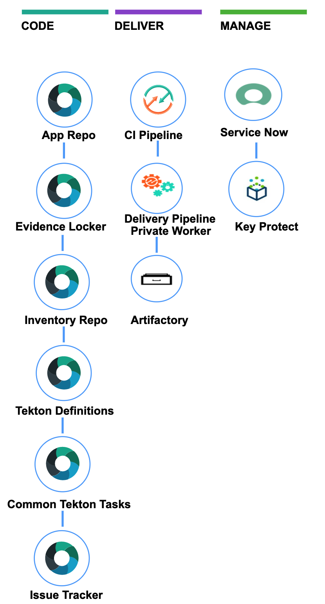
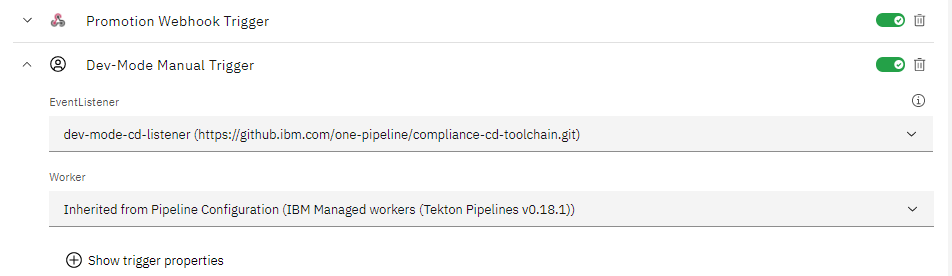
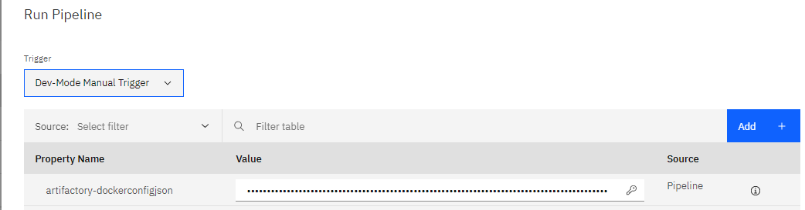

#  Tekton CD Pipeline with Compliance automation for Kubernetes

This is the toolchain template for continuous deployment with Compliance for Kubernetes. It is preconfigured for continuous delivery with inventory integration, change management with Servicenow, evidence collection and deployment to the IBM Kubernetes Service.

The integrated repositories, target cluster and artifactory integrations are configured during the setup process.

The toolchain includes a Tekton delivery pipeline, which can be manually triggered to initiate a new deployment.

The toolchain can use a Key-Protect vault instance to store the required tokens and API keys.

### Graphic Summary

### To get started, click this button:

**For more information about the setup process, check out this guide**

[Setup Guide](/setup.md)

If you get stuck or experience a problem during setup, or running your pipelines, check out our [troubleshooting guide](https://github.ibm.com/one-pipeline/docs/blob/master/faq.md) before raising an issue.

---
### The IAM permissions needed for each of the various IBM cloud resources

| Role | Resource |
|--|--|
|  Administrator, Writer  |  Cloud Object Storage service in <your team's resource group name> resource group  |
|  Administrator, Writer  |  Continuous Delivery service in <your team's resource group name> resource group  |
|  Administrator  |  Toolchain service in <your team's resource group name> resource group  |
|  KeyPurge, Writer, Editor, Manager, Administrator  |   Key Protect service in <your team's resource group name> resource group  |
|  Viewer, Reader, Writer  |   	Kubernetes Service  |
|  Viewer, ReaderPlus  |  Key Protect service in <your team's resource group name> resource group  |

---
### Using the development mode
The development mode enables you to quickly test the implementation of your [shift-left compliance one-pipeline.yaml](https://pages.github.ibm.com/one-pipeline/docs/#/custom-scripts) file, without executing any shift-left compliance related task, so as to optimize pipeline execution time.

* Audience: developers in charge of adopting the shift-left compliance CD pipeline, implementing [the one-pipeline.yaml](https://pages.github.ibm.com/one-pipeline/docs/#/custom-scripts) file.

* Purpose

  - Develop, implement and quickly test a new [shift-left compliance one-pipeline.yaml](https://pages.github.ibm.com/one-pipeline/docs/#/custom-scripts) file using a simplified pipeline.
  - Only execute the various stages of the one-pipeline.yaml file.
  - Skip most of the shift-left compliance related task, hence optimizing the time to execute your code.

* Warning: this mode should be used for **development** purpose **only**, and can not be considered as a replacement of the official shift-left compliance pipelines which remain the reference implementations.

* Prereq: you already created a compliance CD toolchain.

* Set-up
  - Go to the Triggers page of your CD pipeline.
  - Create a new development mode trigger:

    - name: pick a name of your choice (ex: `Dev-Mode Manual Trigger`)

    - EventListener: `dev-mode-cd-listener`

    - Save your changes

  

* Run the Development mode pipeline
  - Back to the `PipelineRuns` page, click on the `Run Pipeline button`.
  - Select Dev Mode trigger you just created.
  - Click on the `Run` button.

  

* Development mode pipeline execution
  - Observe: the pipeline is executed without unnecessary shift-left compliance tasks.
  - Iterate until you're satisfied with your one-pipeline.yaml file implementation.

* Switching back to shift-left compliance CD pipeline
Either disable or delete the development mode trigger.

---
### Learn more
* [Getting Started with Continuous Delivery](https://cloud.ibm.com/docs/services/ContinuousDelivery?topic=ContinuousDelivery-getting-started&pos=2)
* [Continuous Delivery Practices](https://cloud.ibm.com/docs/services/ContinuousDelivery?topic=ContinuousDelivery-gm_cd_best&pos=2)
* [Creating Toolchains](https://cloud.ibm.com/docs/services/ContinuousDelivery?topic=ContinuousDelivery-toolchains_getting_started&pos=2)
* [Working with Tekton Pipelines](https://cloud.ibm.com/docs/services/ContinuousDelivery?topic=ContinuousDelivery-tekton-pipelines)
* [Private Workers](https://cloud.ibm.com/docs/ContinuousDelivery?topic=ContinuousDelivery-install-private-workers)
* [Artifactory](https://taas.w3ibm.mybluemix.net/guides#artifactory)
